# 民间借贷

## 限制条件：

1. 仅支持最多四本不动产权证抵押;
2. 有冻结、有查封、有人工限制的不允许线上抵押;
3. 仅支持前台窗口办理；
4. 徐州不动产登记智能链平台、不动产登记全程网办平台、登记系统、网签系统均无在办业务;

## 系统登录：

登录系统，点击“前往登录——机构登录”，输入账户、密码后点击“登录”按钮。

​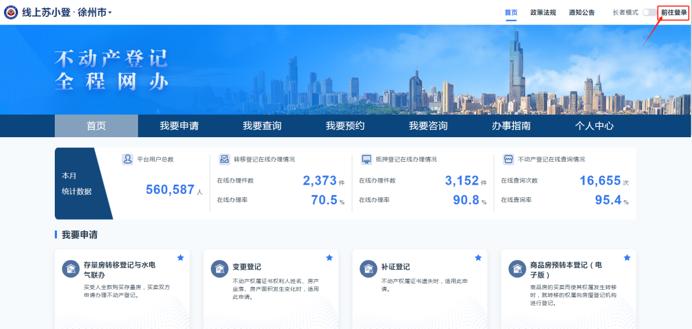​

​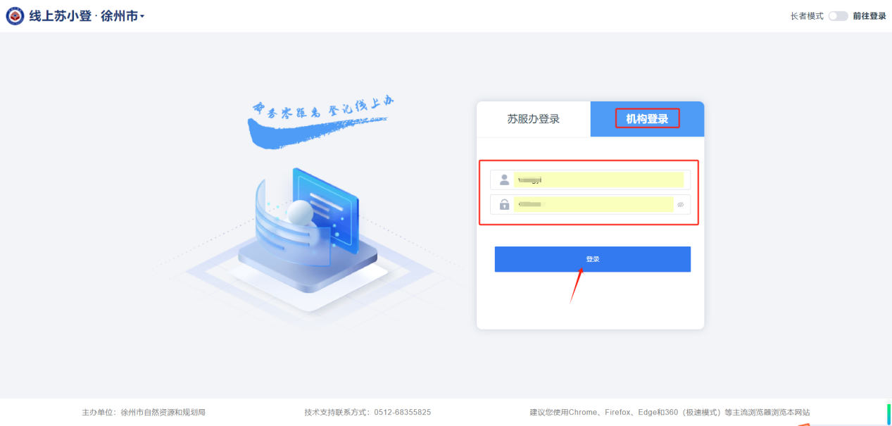​

## 选择业务：。

进入系统首页，点击“我要申请——个人业务——民间借贷”。

​​​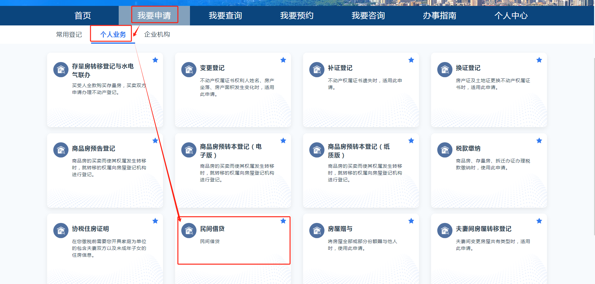​​​

## 选择房屋：

输入不动产权证上年份、证号两部分数字，输入或读取权利人身份信息后点击“查询”，获取到不动产信息。查看并核对不动产信息确认无误，点击“详情”，可查看此不动产的详细信息，包含不动产的权属信息、分幢信息、权利人信息、抵押信息、查封信息、异议信息、居住权信息，核实完毕点击弹窗右上角”x“按钮，关闭详情弹窗。确认所有不动产信息无误，点击”下一步“。

​​​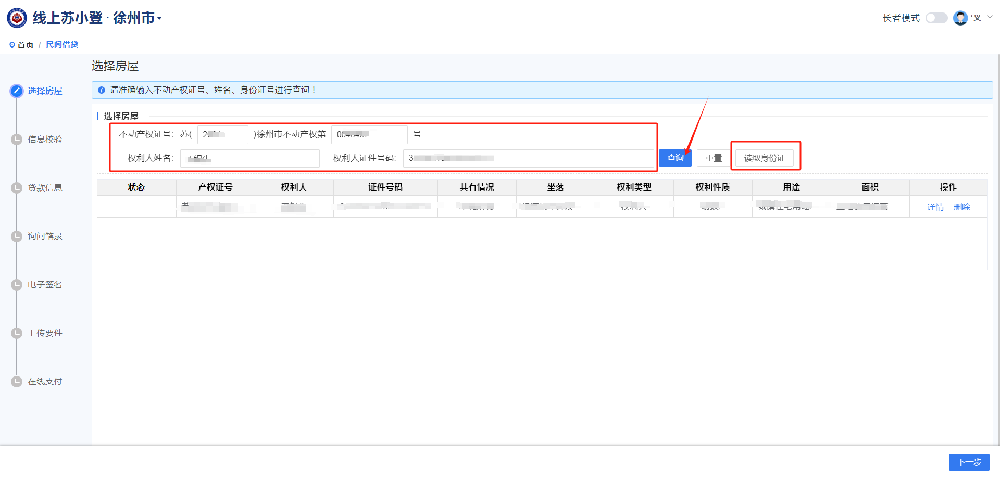​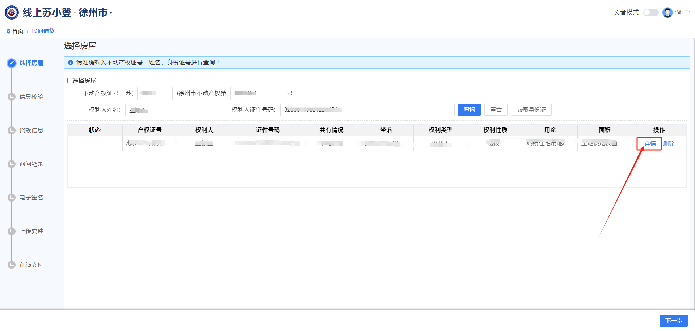​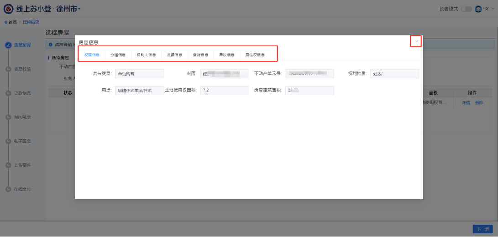​​​​​

​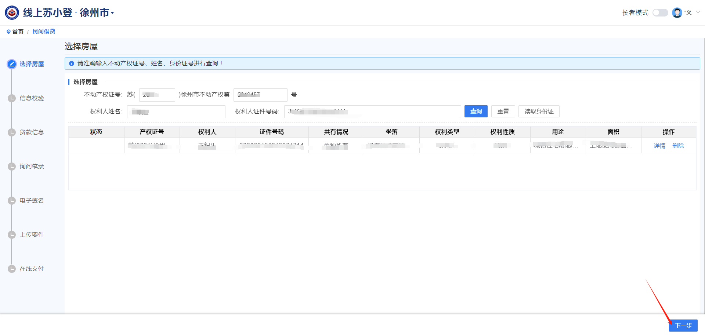​

## 信息校验：

核对并完善抵押人信息（填写联系电话、联系地址）、借款人信息（系统默认和抵押人信息一致，可以删除或新增借款人）、抵押权人信息（如果有多个抵押权人可以点击”新增抵押权人“按钮添加抵押权人），如有代理人可选择“是否代理”添加代理人信息，完善并确认所有申请人信息无误后点击左上角”抵押物信息“，核对抵押物信息，确认所有信息无误后首先点击右下角“保存”然后点击“下一步”，将业务进行保存并进入贷款信息流程。

​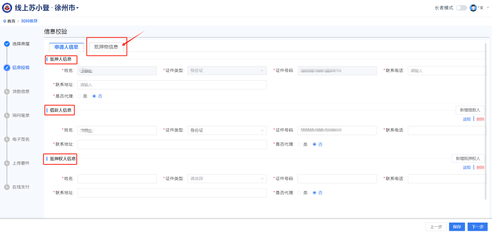​

​​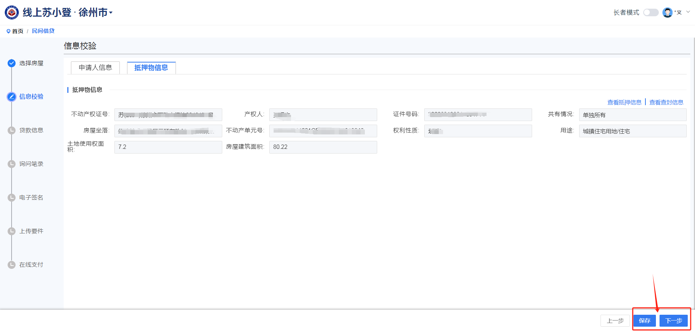​​

## 贷款信息：

填写不动产价值、主债权数额、利率、债务履行期限、房产价值确定方式、贷款发放情形，如果有其他约定事项可以勾选或编辑在其他约定事项文本框内，确认贷款信息填写无误后点击“下一步”。

​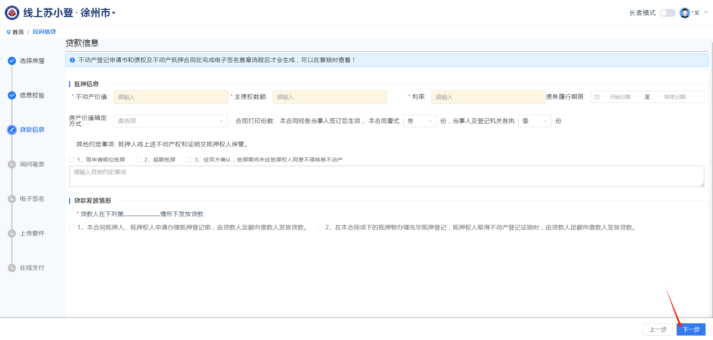​

## 询问笔录：

根据实际情况填写询问笔录，其中带星号的1-6条为必填项，填写完毕勾选“本次申请所填写内容与问询笔录真实……”，然后点击“下一步”。

​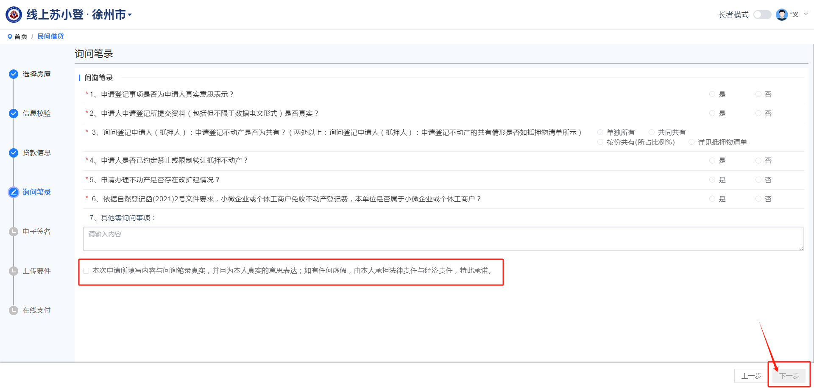​

## 电子签名：

系统提供微信扫码、短信、手写板三种签字方式在线签订不动产登记申请书，申请人都在现场的情况下推荐使用手写板签字。

​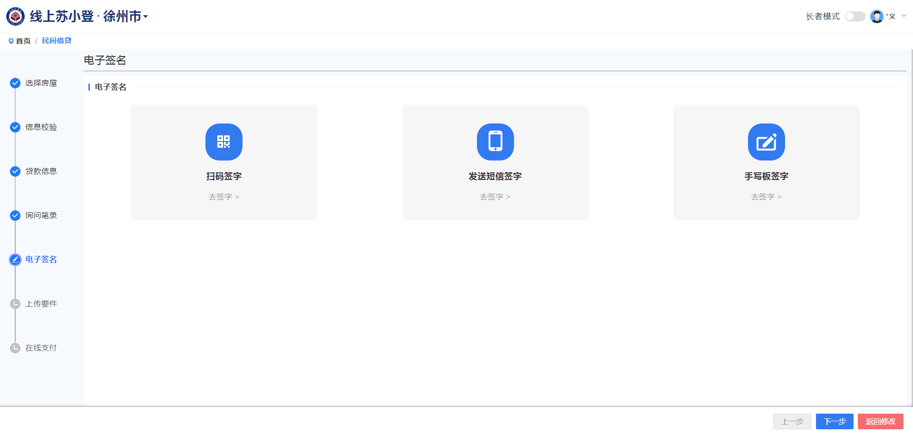​
